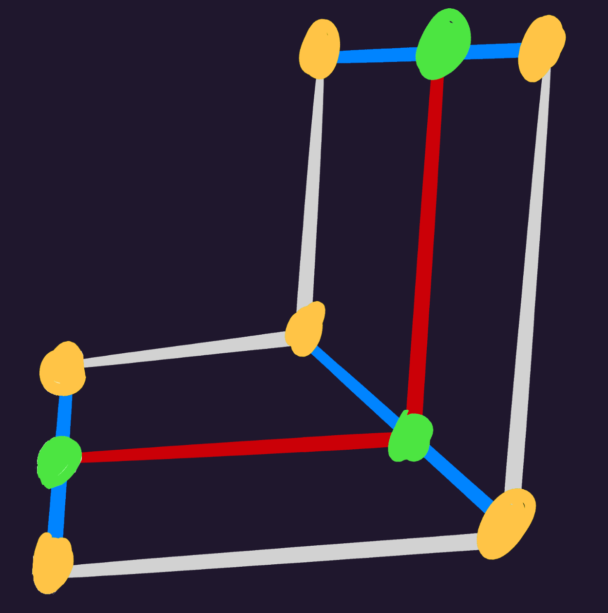

## Table of Contents

- [`Construct()`](#construct)
    - [`inheritance()`](#inheritance)
        - [`resetInheritance()`](#resetinheritance)
    - [`rotate()`](#rotate)
    - [`inverseKinematics()`](#inversekinematics)
        - [`pointBones()`](#pointbones)
        - [`applyConstraints()`](#applyconstraints)
        - [`fabrik()`](#fabrik)
        - [`arcIk()`](#arcik)
    - [`simulatePhysics()`](#simulatephysics)
    - [`constructVerts()`](#constructverts)
        - [Pathing Explained](#pathing-explained)

# `Construct()`

Constructs the armature's bones with inheritance and inverse kinematics.

<pre> <code class="language-typescript hljs">function Construct(armature: Armature): Bone[] {
    // initialize constructed_bones
    if (armature.constructed_bones == undefined) {
        armature.constructed_bones = clone(armature.bones);
    } else {
        // constructed_bones may have been used later for drawing
        // which sorts them by zindex, so sort back by id
        armature.constructed_bones.sort((bone) => bone.id);
    }

    // inheritance is run once to put bones in place,
    // for inverse kinematics to properly determine rotations
    <a href="#resetinheritance">resetInheritance</a>(aramture.constructed_bones, armature.bones);
    <a href="#inheritance">inheritance</a>(armature.constructed_bones, {}, {});

    // inverse kinematics will return which bones' rotations should be overridden
    ikRots: Object = <a href="#inversekinematics">inversekinematics</a>(
        armature.constructed_bones,
        armature.ikRootIds,
    );

    // run inheritance again for IK rotations
    <a href="#resetinheritance">resetInheritance</a>(aramture.constructed_bones, armature.bones);
    <a href="#inheritance">inheritance</a>(armature.constructed_bones, ikRots, {});

    // process physics
    simulate_physics(armature.bones, armature.constructed_bones)

    // run inheritance again for physics
    <a href="#resetinheritance">resetInheritance</a>(aramture.constructed_bones, armature.bones);
    <a href="#inheritance">inheritance</a>(armature.constructed_bones, ikRots, armature.bones);

    // mesh deformation
    <a href="#constructverts">constructVerts</a>((armature.constructed_bones);
}
</code> </pre>

## `inheritance()`

Child bones need to inherit their parent.

```typescript
inheritance(bones: Bone[], ikRots: Object, armature_bones: Bone[]) {
    for(let b = 0; b < bones.length; b++) {
        if(bones[b].parentId != -1) {
            parent: Bone = bones[bones[b].parentId];

            let orbit_rot = bones[bones[b].parent_id as usize].rot
            // apply orbital difference, if rotation resistance physics is active
            if armature_bones.len() > 0 && armature_bones[b].phys_sway > 0 {
                orbit_rot -= armature_bones[b].phys_global_orbit_diff
            }
            bones[b].rot += orbit_rot

            bones[b].scale *= parent.scale

            // adjust child's distance from player as it gets bigger/smaller
            bones[b].pos *= parent.scale

            // rotate child around parent as if it were orbitting
            bones[b].pos = rotate(&bones[b].pos, parent.rot)

            bones[b].pos += parent.pos
        }

        // override bone's rotation from inverse kinematics
        if ikRots[b] {
            bones[b].rot = ikRots[b]
        }

        // apply physics, if armature_bones is provided
        if armature_bones.len() > 0 {
            if bones[b].phys_rot_damping > 0. {
                bones[b].rot = armature_bones[b].phys_global_rot
            }
            if bones[b].phys_pos_damping > 0. {
                bones[b].pos = armature_bones[b].phys_global_pos
            }
            if bones[b].phys_scale_damping > 0. {
                bones[b].scale = armature_bones[b].phys_global_scale
            }
        }
    }
}
```

## `resetInheritance()`

Resets the provided `constructed_bones` to their original transforms.

Must always be called before `inheritance()`.

```typescript
resetInheritance(constructed_bones: Bone[], bones: Bone[]) {
    for(let b = 0; b < bones.length; b++) {
    }
}
```

## `rotate()`

Helper for rotating a Vec2.

```typescript
function rotate(point: Vec2, rot: f32): Vec2 {
    return Vec2 {
        x: point.x * rot.cos() - point.y * rot.sin(),
        y: point.x * rot.sin() + point.y * rot.cos(),
    }
}
```

## `inverseKinematics()`

Processes inverse kinematics and returns the final bones' rotations, which would
later be used by `inheritance()`.

IK data for each set of bones is stored in the root bone, which can be iterated
wth `ikRootIds`.

<pre> <code class="language-typescript hljs">function inverseKinematics(bones: Bone[], ikRootIds: int[]): Object {
    ikRot: Object = {}

    for(let rootId of ikRootIds) {
        family: Bone[] = bones[rootId]

        // get relevant bones from the same set
        if(family.ikTargetId == - 1) {
            continue
        }
        root: Vec2 = bones[family.ikBoneIds[0]].pos
        target: Vec2 = bones[family.ikTargetId].pos
        familyBones: Bone[] = bones.filter(|bone|
            family.ikBoneIds.contains(bone.id)
        )

        // determine which IK mode to use
        switch(family.ikMode) {
            case "FABRIK":
                for range(10) {
                    <a href="#fabrik">fabrik</a>(*familyBones, root, target)
                }
            case "Arc":
                <a href="#arcik">arcIk</a>(*familyBones, root, target)
        }

        <a href="#pointbones">pointBones</a>(*bones, family)
        <a href="#applyconstraints">applyConstraints</a>(*bones, family)

        // add rotations to ikRot, with bone ID being the key
        for(let b = 0; b < family.ikBoneIds.length; b++) {
            // last bone of IK should have free rotation
            if(b == family.ikBoneIds.len() - 1) {
                continue
            }
            ikRot[family.ikBoneIds[b]] = bones[family.ikBoneIds[b]].rot
        }
    }

    return ikRot
}
</code> </pre>

## `pointBones()`

Point each bone toward the next one.

Used by `inverseKinematics()` to get the final bone's rotations.

```typescript
function pointBones(bones: Bone[]*, family: Bone) {
    endBone: Bone = bones[family.ikBoneIds[-1]]
    tipPos: Vec2 = endBone.pos
    for(let i = family.ikBoneIds.length - 1; i > 0; i--) {
        bone = *bones[family.ikBoneIds[i]]
        dir: Vec2 = tipPos - bone.pos
        bone.rot = atan2(dir.y, dir.x)
        tipPos = bone.pos
    }
}
```

## `applyConstraints()`

Applies constraints to bone rotations (clockwise or counter-clockwise).

1. Get angle of first joint
2. Get angle from root to target
3. Compare against the 2 based on the constraint
4. If the constraint is satisfied, apply `rot + baseAngle * 2` to bone rotation

```typescript
function applyConstraints(bones: Bone[], family: Bone) {
    jointDir: Vec2 = normalize(bones[family.ikBoneIds[1]].pos - root);
    baseDir: Vec2 = normalize(target - root);
    dir: float = jointDir.x * baseDir.y - baseDir.x * jointDir.y;
    baseAngle: float = atan2(baseDir.y, baseDir.x);
    cw: bool = family.ikConstraint == "Clockwise" && dir > 0;
    ccw: bool = family.ikConstraint == "CounterClockwise" && dir < 0;
    if (ccw || cw) {
        for (let id of family.ikBoneIds) {
            bones[id].rot = -bones[id].rot + baseAngle * 2;
        }
    }
}
```

## `fabrik()`

The FABRIK mode (Forward And Backward Reaching Inverse Kinematics).

Note that this should be run multiple times for higher accuracy (usually 10
times).

Source for algorithm:
[Programming Chaos' FABRIK video](https://www.youtube.com/watch?v=NfuO66wsuRg)

```typescript
function fabrik(bones: Bone[], root: Vec2, target: Vec2) {
    // forward-reaching
    nextPos: Vec2 = target;
    nextLength: float = 0.0;
    for (let b = bones.length - 1; b > 0; b--) {
        length: Vec2 = normalize(nextPos - bones[b].pos) * nextLength;
        if (isNaN(length)) length = new Vec2(0, 0);
        if (b != 0) nextLength = magnitude(bones[b].pos - bones[b - 1].pos);
        bones[b].pos = nextPos - length;
        nextPos = bones[b].pos;
    }

    // backward-reaching
    prevPos: Vec2 = root;
    prevLength: float = 0.0;
    for (let b = 0; b < bones.length; b++) {
        length: Vec2 = normalize(prevPos - bones[b].pos) * prevLength;
        if (isNaN(length)) length = new Vec2(0, 0);
        if (b != bones.len() - 1)
            prevLength = magnitude(bones[b].pos - bones[b + 1].pos);
        bones[b].pos = prevPos - length;
        prevPos = bones[b].pos;
    }
}
```

## `arcIk()`

Arcing IK mode.

Bones are positioned like a bending arch, with the max length being the combined
distance of each bone after the other.

```typescript
function arcIk(bones: Bone[], root: Vec2, target: Vec2) {
    // determine where bones will be on the arc line (ranging from 0 to 1)
    dist: float[] = [0.]

    maxLength: Vec2 = magnitude(bones.last().pos - root)
    currLength: float = 0.
    for(let b = 1; b < bones.length; b++) {
        length: float = magnitude(bones[b].pos - bones[b - 1].pos)
        currLength += length;
        dist.push(currLength / maxLength)
    }

    base: Vec2 = target - root
    baseAngle: float = base.y.atan2(base.x)
    baseMag: float = magnitude(base).min(maxLength)
    peak: float = maxLength / baseMag
    valley: float = baseMag / maxLength
    for(let b = 1; b < bones.length; b++) {
        bones[b].pos = new Vec2(
            bones[b].pos.x * valley,
            root.y + (1.0 - peak) * sin(dist[b] * PI) * baseMag,
        )

        rotated: float = rotate(bones[b].pos - root, baseAngle)
        bones[b].pos = rotated + root
    }
}
```

## `simulatePhysics()`

Processes all physics:

- Position (`phys_pos_damping`)
- Scale (`phys_scale_damping`)
- Rotation (`phys_rot_damping`)
- Sway (`phys_sway`)
- Bounce (`phys_rot_bounce`)

<pre> <code class="language-typescript hljs">function simulatePhysics(armature_bones, constructed_bones) {
    for(let b = 0; b < armature_bones.length; b++) {
        let s = Vec2(0.3, 0.3)
        let e = Vec2(0.6, 0.6)
        let arm_bone = &mut armature_bones[b]
        let const_bone = &constructed_bones[b]
        let prev_pos = arm_bone.phys_global_pos

        // interpolate position
        if(arm_bone.phys_pos_damping > 0 || arm_bone.phys_sway > 0) {
            let phys_pos = &arm_bone.phys_global_pos
            let damping = Vec2(arm_bone.phys_pos_damping, arm_bone.phys_pos_damping)

            // ratio
            if(arm_bone.phys_pos_ratio < 0) {
                damping.y *= 1. - Math.abs(arm_bone.phys_pos_ratio)
            } else if(arm_bone.phys_pos_ratio > 0) {
                damping.x *= 1. - arm_bone.phys_pos_ratio
            }

            cb_scale = const_bone.scale
            phys_pos.x = interpolate(2, damping.x, phys_pos.x, const_bone.pos.x, s, e)
            phys_pos.y = interpolate(2, damping.y, phys_pos.y, const_bone.pos.y, s, e)
        }

        // interpolate scale
        if(arm_bone.phys_scale_damping > 0) {
            let phys_scale = &arm_bone.phys_global_scale
            let damping = Vec2(arm_bone.phys_scale_damping, arm_bone.phys_scale_damping)

            // ratio
            if(arm_bone.phys_scale_ratio < 0) {
                damping.y *= 1. - arm_bone.phys_scale_ratio.abs()
            } else if(arm_bone.phys_pos_ratio > 0) {
                damping.x *= 1. - arm_bone.phys_scale_ratio
            }

            cb_scale = const_bone.scale
            phys_scale.x = interpolate(2, damping.x, phys_scale.x, cb.scale.x, s, e)
            phys_scale.y = interpolate(2, damping.y, phys_scale.y, cb.scale.y, s, e)
        }

        // interpolate rotation
        if(arm_bone.phys_rot_damping > 0) {
            let rot = shortest_angle_delta(arm_bone.phys_global_rot, const_bone.rot)
            arm_bone.phys_global_rot += rot / arm_bone.phys_rot_damping
        }

        // interpolate parent orbit (rot res, bounce, etc)
        let parent = constructed_bones.find((b) => b.id == const_bone.parent_id2)
        if(arm_bone.phys_sway > 0 && parent != None) {
            // interpolate to the angle difference between bone and parent
            let diff = normalize(const_bone.pos - parent.unwrap().pos)
            let diff_angle = diff.y.atan2(diff.x)
            let mut rest_rot = shortest_angle_delta(arm_bone.phys_global_orbit, diff_angle)
            // apply bounce
            if(arm_bone.phys_rot_bounce > 0. && arm_bone.phys_rot_bounce <= 1) {
                rest_rot += arm_bone.phys_global_orbit_vel / (2 - arm_bone.phys_rot_bounce)
                arm_bone.phys_global_orbit_vel = rest_rot
            }
            arm_bone.phys_global_orbit += rest_rot / 10

            // swing orbit based on position momentum
            let vel = normalize(arm_bone.phys_global_pos - prev_pos)
            let angle = (-vel.y).atan2(-vel.x)
            let vel_rot = shortest_angle_delta(arm_bone.phys_global_orbit, angle)
            let strength = magnitude(arm_bone.phys_global_pos - prev_pos) / 1000
            arm_bone.phys_global_orbit += vel_rot * strength * arm_bone.phys_sway

            // apply difference in final angle and orbit
            arm_bone.phys_global_orbit_diff = diff_angle - arm_bone.phys_global_orbit
        }
    }
}
</code> </pre>

## `constructVerts()`

Constructs vertices, for bones with mesh data.

Note: a helper function (`inheritVert()`) is included in the code block below

```typescript
function constructVerts(bones: Bone[]) {
    for(let b = 0; b < bones.length; b++) {
        bone: Bone = bones[b]

        // Move vertex to main bone.
        // This will be overridden if vertex has a bind.
        for(let v = 0; v < bone.vertices.length; v++) {
            bone.vertices[v].pos = bone.vertices[v].init_pos;
            bone.vertices[v] = inheritVert(bone.vertices[v].pos, bone)
        }

        for(let bi = 0; bi < bones[b].binds.length; bi++) {
            let boneId = bones[b].binds[bi].boneId
            if boneId == -1 {
                continue
            }
            bindBone: Bone = bones.find(|bone| bone.id == bId))
            bind: Bind = bones[b].binds[bi]
            for(let v = 0; v < bind.verts.length; v++) {
                id: int = bind.verts[v].id

                if !bind.isPath {
                    // weights
                    vert: Vertex = bones[b].vertices[id]
                    weight: float = bind.verts[v].weight
                    endpos: Vec2 = inheritVert(vert.initPos, bindBone) - vert.pos
                    vert.pos += endPos * weight
                    continue
                }

                // pathing

                // Check out the 'Pathing Explained' section below for a
                // comprehensive explanation.

                // 1.
                // get previous and next bind
                binds: Bind[] = bones[b].binds
                prev: int = bi > 0 ? bi - 1 : bi
                next: int = min((bi + 1, binds.length - 1)
                prevBone: Bone = bones.find(|bone| bone.id == binds[prev].boneId)
                nextBone: Bone = bones.find(|bone| bone.id == binds[next].boneId)

                // 2.
                // get the average of normals between previous and next bind
                prevDir: Vec2 = bindBone.pos - prevBone.pos
                nextDir: Vec2 = nextBone.pos - bindBone.pos
                prevNormal: Vec2 = normalize(Vec2.new(-prevDir.y, prevDir.x))
                nextNormal: Vec2 = normalize(Vec2.new(-nextDir.y, nextDir.x))
                average: Vec2 = prevNormal + nextNormal
                normalAngle: float = atan2(average.y, average.x)

                // 3.
                // move vert to bind, then rotate it around bind by normalAngle
                vert: Vertex = bones[b].vertices[id]
                vert.pos = vert.initPos + bindBone.pos
                rotated: Vec2 = rotate(vert.pos - bindBone.pos, normalAngle)
                vert.pos = bindBone.pos + (rotated * bind.verts[v].weight)
                bones[b].vertices[id] = vert
            }
        }
    }
}

function inheritVert(pos: Vec2, bone: Bone): Vec2 {
    pos *= bone.scale
    pos = utils.rotate(&pos, bone.rot)
    pos += bone.pos
    return pos
}
```

## Pathing Explained

Instead of inheriting binds directly, vertices can be set to follow its bind
like a line forming a path:



- Green - bind bone
- Orange - vertices
- Red - imaginary line from bind to bind
- Blue - Normal surface of imaginary line

Vertices will follow the path, distancing from the bind based on its surface
angle and initial position from vertex to bind.

The following steps can be iterated per bind:

### 1. Get Adjacent Binds

To form the imaginary line, get the adjacent binds just before and just after
the current bind. In particular:

- If current bind is first: get only next bind
- If current bind is last: get only previous bind
- If current bind is neither: get both previous and next bind

### 2. Get Average Normal Angle

Notice that in the diagram, the middle bind's surface is at a 45° angle.

To do so:

1. Get line from previous to current bind
2. Get line from current to next bind
3. Add up both lines
4. Get angle of combined line

### 3. Rotate Vertices

1. Reset vertex position to its initial position + bind position
2. Rotate vertex around bind with angle from 2nd step
